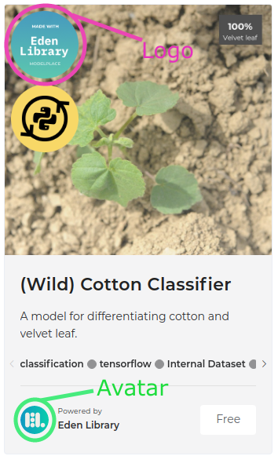

This is an instruction on how to integrate a model into [Modelplace.AI](https://modelplace.ai/).  
We support [PyTorch](https://pytorch.org/), [Tensorflow](https://www.tensorflow.org/), [OpenVINO](https://docs.openvinotoolkit.org/latest/index.html) and [ONNXRuntime](https://www.onnxruntime.ai/) backends.

# How to provide a model?

To provide a model we ask you to do the following:
1. Provide [publishing information](#publishing-information) about yourself and a model you want to publish
2. Set up [environment](#evironment) and try our [example](pytorch_fastercnn)
3. Implement your model in a similar with our [example](pytorch_fastercnn)
4. Create wheel [package](#package) with your model

## Publishing information
### Required
- **Model description** - this is the whole description of what the model does (e.g. [model page](https://modelplace.ai/models/2) - the text in summary block)
- **Model description preview short** - the text people see on a card on the [main page](https://modelplace.ai/) (just after the model name)
- **Model name full** - on a model page - (e.g. Faster region-based convolutional neural network with ResNet-50 FPN backbone, [model page](https://modelplace.ai/models/2))
- **Model name short** - on the [main page](https://modelplace.ai/) (e.g. Faster R-CNN)
- **Dataset name** - it may be public data e.g. MSCOCO or Open images, or your internal dataset
- **Preview image** - we will run a model on the image and will use its output for visualization. This image will be both on the [main page](https://modelplace.ai/) and on the [model page](https://modelplace.ai/models/2)
- **License** - license type e.g. Apache 2.0, MIT, Proprietary and so on
- **Number of classes** 
- **Author** - your name or company name
- **Metrics** - accuracy of your model

### Optional
- **Dataset link** - link to a dataset that you use for training and testing of your model
- **Source link** - link to your project page or profile page or company page and so on
- **System requirements** - what system setup (e.g. number of CPU GPU RAM) we should use to serve your model
- **Logo** - we will add it to the preview  
_Note: This should be svg (png is possible) image with circle shape and size 128x128 pixels at least_
- **Avatar image** - you can add your own logo (by default we use ours)  
_Note: This should be svg (png is possible) image with circle shape and size 128x128 pixels at least_

## Evironment
- Install venv  
```python3.7 -m pip install virtualenv```
- Create an empty virtual environment for python3.7  
```python3.7 -m  virtualenv  venv```
- Activate it  
```source venv/bin/activate```
- Install pytest and wheel  
```python3.7 -m pip install pytest wheel```
- Install git and git-lfs  
```sudo apt install git git-lfs```
- Clone the repo   
```git clone https://github.com/opencv-ai/modelplace.git```

## Example
You can run [an example](pytorch_fastercnn) of a package
- Go to package folder pytorch_fastercnn  
```cd modelplace/pytorch_fastercnn```
- Install the package  
```python3.7 setup.py bdist_wheel && rm -R build/ *.egg-info && pip3 install dist/*.whl```
- Run tests  
```python3.7 -m pytest```

Example of model usage you can find [here](https://modelplace.ai/models/2)

## Package
We use an abstraction to unify model serving. You should create [a wheel package](https://packaging.python.org/tutorials/packaging-projects/#creating-the-package-files) with our interfaces. You can find example [here](pytorch_fastercnn).

To create a package, follow the steps:
- Copy [the template folder](template)
- Extend model.py as it's done in [an example](pytorch_fastercnn/pytorch_fastercnn/model.py)
- Update [the setup.py](template/setup.py)
- Copy your checkpoints to [the template/checkpoints](template/template/checkpoints) folder
- Rename "template" to your package name in all locations, including the folder name, e.g. template -> pytorch_fastercnn
- Install the package locally  
```python3.7 setup.py bdist_wheel && rm -R build/ *.egg-info && pip3 install dist/*.whl```
- Update tests in [test_model.py](template/tests/test_model.py)
- Run tests  
```python3.7 -m pytest```
- Make sure that the tests are working correctly and passed
- Zip the folder with the completed template
- [Send us](mailto:modelplace@opencv.ai) this zip and information about package
